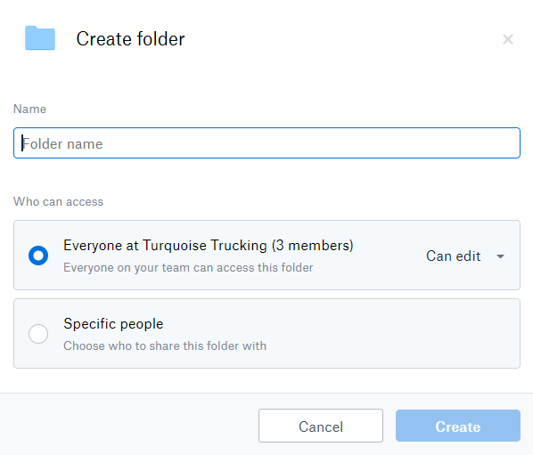
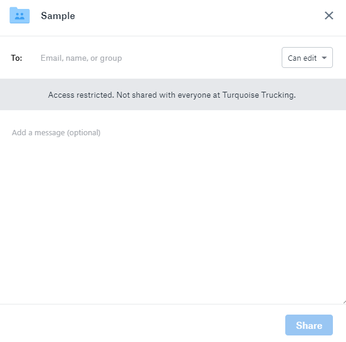
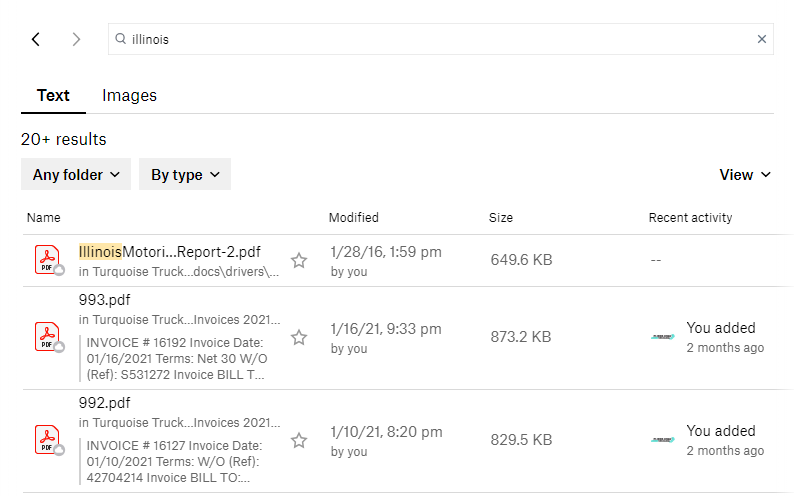
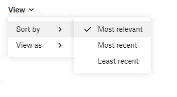

# Cloud Storage

Written 2021-03-10 by John Earl Hardesty

[TOC]

## Proposal

As part of our paperless office initiative, we have chosen [Dropbox Business](https://www.dropbox.com/business) as our cloud solution. 

There are **5 Terabytes** of storage shared across all members. If we assume each PDF averages one megabyte, and we decide to only store documents, **Dropbox can store 5 million PDFs**. Of course, documents vary by size and we can store more than just documents on the cloud.

**All documents should be stored in Dropbox**, including documents already stored in other cloud solutions.

This document covers how members and groups are managed, where files are stored, backup options, searching, and creating new documents.

## Access control

This section covers how new folders are made and who can access them. Also, proposed member and group schemes. By default, everyone can edit new folders.

### Creating a folder

Visit [Dropbox](https://www.dropbox.com/home) and navigate to where you want to create a folder. Then press **+ Create** and **Folder**. 

The folder permission window will open.

Name the folder following rules in our style guide. Everyone in an organization can edit new folders unless specified. Options are:

* Can edit
  * People can edit, delete, comment, and add the files to their Dropbox
* Can view
  * People can view, download, and comment

Let's take a step back. Cloud storage should replace traditional paper filing. When we determine access to a digital file we should consider it the same way as our real-life filing system. Are files kept in a filing cabinet? If so, is it locked? These questions can help determine who has access to digital files.

The whole point of having multiple members is to restrict access. Let's choose specific people. 

You may choose people by their email, name, or group. **Groups offer wider** control and are **easier to maintain over time**. Chances are, you will always have an accounting department and a dispatch team right?

What if an employee leaves? Removing them from a group in the admin panel is easy. What about all the folders in the organization? If folders are given access based on members you would have to update every single folder.

### Members

**People, users, members, licenses, are all the same thing in Dropbox.** So, if we intend to keep only 3 licenses (the default) then a person would be someone that knows the username and password to a Dropbox account. 

Currently, there are 3 members:

1. Turquoise Trucking, **contact**@turquoise
2. **Dispatch Team**, dispatch@turquoise
3. **Matt Keel**, matt@turquoise

**Contact** was the original Dropbox account member. While Dispatch Team and Matt Keel were added after upgrading to Dropbox Business. These members can be changed at any time.

To cover all staff members we would need to purchase more licenses.  

**Each additional license will cost $150/year or $12.50/month when paid annually.**

| Licenses / Users | Total per Year |
| ---------------- | -------------- |
| 3                | $450           |
| 4                | $600           |
| 5                | $750           |
| 6                | $900           |
| 7                | $1050          |

These totals do not include sales tax.

From a security perspective, no one should *share* access. Every user should have their own user account. But, that would be very expensive. 

Clearly, we need more than 3 licenses but not over 7. Let's consider groups.

### Groups

With only three members I've created four groups

**Current members that can edit areas** 

| Members  | Accounts Payable | Human Resources | Support | Operations |
| -------- | :--------------: | :-------------: | :-----: | :--------: |
| Contact  |        ✏️         |        ✏️        |    ✏️    |     ✏️      |
| Dispatch |                  |                 |         |     ✏️      |
| Matt     |                  |        ✏️        |         |     ✏️      |

* Accounts Payable
  * Members that deal with invoices, receipts, settlements
* Human Resources
  * Members that deal with personnel, hiring, terminations
* Support
  * Members that deal with IT, technical support, infrastructure
* Operations
  * Members that deal with trucks, trailers, BOLs, loads, safety 

There are only so many ways to manage four groups with only 3 members.

Let's consider real-world groups. Rashad and Bow are founders of Turquoise and should have edit access to everything. Their group is immutable and should not be shared with anyone but them. Everyone should have access to operations. Financial files may not need to be viewed by everyone but they should only be edited by accounting staff. Driver onboarding, DQ and confidential, are HR related files.  Support files should be viewable to everyone.

**If we had a additional license** we can expand on these groups:

* Founders (Rashad and Bow)
  * Can view and edit all files
* Accounts Payable (Rashad and Rachel)
  * Can edit financial files
* Operations & Safety (Bow, EJ, Rashad, Matt, Rachel)
  * Can edit load paperwork
* Human Resources (Matt)
  * Can edit driver files

**Proposed groups that can ✏️ edit  **

| Groups           | Accounts Payable | Human Resources | Operations | (Anything) |
| ---------------- | :--------------: | :-------------: | :--------: | :--------: |
| Founders         |        ✏️         |        ✏️        |     ✏️      |     ✏️      |
| Accounts Payable |        ✏️         |        👁️        |     👁️      |     👁️      |
| Human Resources  |        👁️         |        ✏️        |     👁️      |     👁️      |
| Operations       |        👁️         |        👁️        |     ✏️      |     👁️      |

Because we are a small office everyone needs view access to everything. We don't lock particular file cabinets. Our cloud solution should reflect our real world organization scheme.

**What needs to be changed?**

* Contact member renamed to Founders
  * Change password and share only between Rashad and Bow
  * Support, or anyone that has admin access to Dropbox should also be in this group
* APR Team @ Turquoise **added** as a license
  * This is shared between Rachel, Jaan, anyone dealing with accounting
  * Financial data is a critical department, trust whomever we share it with
* Operations & Safety
  * This is shared between EJ and Bow
* Matt is the sole HR person
  * If that changes a new email address must be made to reflect an HR department. This will probably be internal. Could be easier to make a cheap Gmail account like turquoise.hr@gmail.com.

In this proposal we need **one additional license**.

Positives:

* Cheap

Negatives:

* Security risk sharing log-in credentials 

**Groups and members seem the same?** Well, in effect they are because we have far fewer licenses to employees. Groups, as a Dropbox feature, may not even need to be used.

## Organizing files

There are three ways to organize Dropbox; short and deep, long and shallow, or a hybrid of both.

### Short and deep

There is a shorter list of files at the top, but their structure is deep like the roots of a tree. This is a bucket approach, putting related pieces of information into similar buckets. 

Below we organize top-level folders **based on our live Dropbox account:** 

> **Bold text is new folders**
>
>  *Italic text is proposed changes*
>
> Chevrons (>) indicate a folder leading to another folder

**Accounts Payable**

* 2020 Received 1099
  * *Received 1099 > 2020*
* 2021 Expenses
  * *Expenses > 2021*
* Accounting Stuff
  * Some of these may be placed in the root of the Accounts Payable folder
* IFTA 2020
* IFTA 2021
  * *IFTA > 2021*
  * *IFTA > 2020*
* Invoices 2020
* Invoices 2021
  * *Invoices > 2021*
  * *Invoices > 2020*
* Payroll 2020
* Payroll 2021
  * *Payroll > 2021*
  * Payroll  > 2021

**Human Resources**

* Driver On Boarding
  * *Onboarding*
* new drivers
  * These will be migrated into the Drivers folder
* **Drivers**
  * *(Year of Hire) > (Name)*
    * **Confidential**
    * **DQ**

**Operations & Safety**

* Broker Setup Files
  * Moved to Set Up Packets
* Open Loads
  * Is this abandon?
* Set Up Packets
  * Includes our own in the root then a Broker Setup Packets folder
* Turquoise Trucks
  * *Trucks* (has same sub-menus as trailers)
* **Trailers**
  * **Maintenance**
  * Violations
  * **Registrations**
  * **CAB cards**
  * **Inspections**
* **Accidents**
  * Rarer than other events, these are given an auto-incrementing number based on LoadStop

**Support**

* **Training**
  * Support files specific to drivers such as LoadStop and KeepTruckin'
  * QP Lessons

**Scans**

* *ScanScape* files
* All scans can go here and be organized later on

**Unknown?**

* desk
* Masaustu
* My PC (OM1)
  * Rachel remove
* Screenshots
  * remove
* turqfile 
  * **Accessorials** and other files to organize later

#### Folder demo

[Explore an interactive file tree](https://turquoise-trucking.github.io/cloud-filetree.html) to see a short and deep layout in action. 

### Long and shallow

We could mimic how files are stored now. This leads to a long list of files but their structure is shallow. The benefit would be less clicks to get to resources. But, would lead to visual clutter. 

[A psychology study](https://en.wikipedia.org/wiki/The_Magical_Number_Seven,_Plus_or_Minus_Two) in 1956 by George Miller demonstrates that our short-term memory is able to recall information in about 7 pieces, plus or minus 2. This is most likely due to [chunking](https://en.wikipedia.org/wiki/Chunking_(psychology)) which is a design principle in a number of fields. I won't delve into the specifics of cognitive psychology as it is beyond the scope of this document.

I would not recommend this organization scheme. The more unique resources we upload to the cloud, the longer the list of files become. 

### Hybrid approach

We could combine both styles. An example would be an inspection on Al's truck. Let's see how they would be organized in all 3 organizational styles.

1. **Short and deep** inspections occur on either a truck or trailer which belong to Operations. **The folder structure is critical.** The file name should contain the date, but otherwise it can be called anything.

   > Operations and Safety > Trucks > Owner-operators > Al 9499 > Inspections > 2021 > **03-17.pdf**

2. **Long and shallow** inspections are a flat file with names and types. The **filename of the inspection is critical**. Otherwise, we won't know exactly what each document is without opening them.

   > Inspections > **2021-03-17 Al 9499.pdf**

3. **Hybrid approach** inspections would provide some specificity while reducing how many folders deep resources are stored. A few examples include:

   > Operations and Safety > Inspections > Trucks > **2021-03-17 AL 9499.pdf**
   >
   > Operations and Safety > Inspections > Al 9499 > **2021-03-17 Al.pdf**
   >
   > Inspections > 2021 > Trucks > **03-17 Al 9499.pdf**
   >
   > Inspections > 2021 > Al 9499 > **03-17.pdf**

A hybrid approach is flexible but requires more work in how data is structured. We would need to sit down and figure out specifics on a case-by-case basis. 

## PC backups

Dropbox can [backup users computers](https://help.dropbox.com/installs-integrations/sync-uploads/computer-backup) but this has security concerns when sharing login information. 

For example, the Accounts Payable department has three members; Rachel, Rashad, and Jaan. Rashad belongs to the Founders group (or member if we don't buy many licenses) so we can restrict access between him and Bow. Meanwhile, Jaan may use the NOC PC or the custom PC "Cybertron" in the dispatch office. Both Rachel and Jaan would have access to files across three computers. 

That said, any backup solution is better than no backup solution. 

[Google Drive](https://www.google.com/drive/) is also an option.

We already leverage [Google Workspace](https://workspace.google.com/) at Turquoise. This affords every Gmail account **30 GB of storage**. Specific folders should be chosen to sync. Places where important files live include:

* Documents
* Desktop
* Downloads
* Pictures

With enough space you could also point to the user folder itself. In Windows 10 that is in **(C:) Users** > ***user name*** by default where *user name* is the name you log in to Windows with. 

### Backup and restore

Microsoft approves of two options to [backup Windows 10](https://support.microsoft.com/en-us/windows/backup-and-restore-in-windows-10-352091d2-bb9d-3ea3-ed18-52ef2b88cbef). 

Using OneDrive to backup user files such as; documents, desktop, and downloads. Or File History which requires an external hard drive. 

There are **benefits** to using on-site backups with an external hard drive:

* Quick access to data without an internet connection
* Lower cost compared to paying a cloud subscription
* Ease of installation

**Disadvantages** include:

* Damage due to accident or natural disaster 
* Security because of theft

Using encryption is one way to counter that last point. But, many of our PCs are laptops. Which makes "grab and go theft" more problematic.

### Recommendation

**Google Drive should cover most of our backup use cases.** We overestimate how much storage space we typically use. Unless Gmail is used as a storage solution (Dispatch email) each user should have ample space to store their user files. This keeps personal files private to each users Gmail login. 

Dropbox Business may be used as well with one caveat. **Group members can view and edit each others personal files.** Although, this may be considered a feature. Being able to access all files, across computers, would yield powerful search capabilities. Which is a great segue into the next section.

## Searching Dropbox

The power of having everything digital is the ability to search across files. The search interface may change slightly between the Dropbox desktop app, mobile app, and website. The photos in this document are from the desktop app. 

By default, Dropbox searches on text files. The Results number is misleading. and change as you scroll. Pressing the **by type** button shows a list of file types to specify searches for. 

Results can be sorted by most relevant, most recent, or least recent. Most relevant would return documents with more occurrences of keywords. Most recent sorts newer files at the top. While least recent reverses the order.

Results show as a grid by default. When you need to visually search files choose to view results as a large grid.

## Creating new documents

You can create documents directly inside Dropbox. These include:

* Microsoft 365 Online
  * These require a commercial license of Microsoft 365
  * [Word document](https://www.microsoft.com/en-us/microsoft-365/word)
  * [Excel workbook](https://www.microsoft.com/en-us/microsoft-365/excel)
  * [PowerPoint presentation](https://www.microsoft.com/en-us/microsoft-365/powerpoint)
* Google Docs
  * [Google docs](https://www.google.com/docs/about/)
  * [Google sheets](https://www.google.com/sheets/about/)
  * [Google slides](https://www.google.com/slides/about/)
* Shortcut
  * Points to a web page or other online resource
* [Paper](https://en.wikipedia.org/wiki/Dropbox_Paper) (Available as **Create Paper doc**)
  * Collaborative document that can have images, videos, and other media embedded into it

There are pros and cons to each of these filetypes. Use whichever is most familiar to you. **Dropbox Paper** offers excellent tutorials to get you started. 

Microsoft 365, Google Docs, and Paper can all be exported to multiple formats including PDF. But, you should not export to PDF if you are working with a [living document](https://en.wikipedia.org/wiki/Living_document) or require further collaboration. 

## Wrapping up

This is a large document. It was actually much larger before I moved the style guide to its own document.

**Access control**

* License per each employee makes the most sense but is financially prohibitive
* For now, let's explore and build Dropbox into an essential part of a paperless office

**Organizing Files**

* Short and deep or a hybrid approach should be used
* Regardless of organization scheme, everyone must follow the style guide

**PC Backups**

* Google Drive would work for most PCs 
  * But requires a Google Workspace account assigned to each
* Dropbox Business would allow all group members to view and modify backup files
  * Unless each PC had its own, unique Dropbox license
  * Searches would work across every file at Turquoise

## Changelog

This is a living document. Changes will show up below.

2021-03-21Pre-release revisions

* Access Control
  * Clarified member synonyms 
  * Changed **By department** organization scheme to **Short and deep**
* Computer backups
  * Renamed to **PC backups**
* Added Wrapping Up section
* Revisions

2021-03-22 First publication