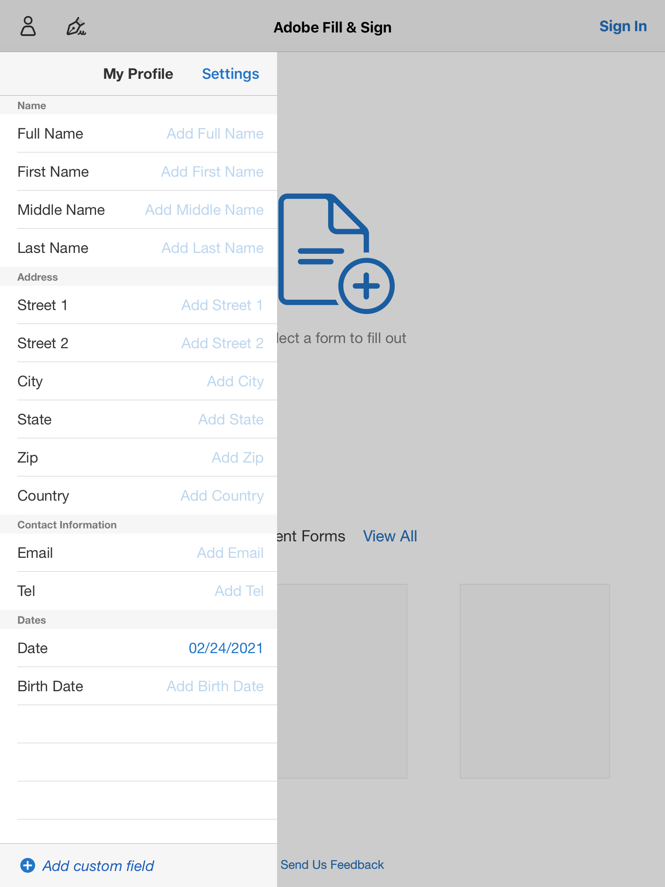

# Driver Paperwork

Written 2021-02-22 by John Earl Hardesty

[TOC]

## Proposal

In an effort to reduce paper in the office, new driver paperwork must be kept digital. Our current method is wasteful in both paper and time. 

This document includes recommendations to shift onboarding entirely digital.

### We are Partially Paperless

As of early 2021, we have begun the steps needed to go paperless. Currently, all driver onboarding is done on printed paper and then scanned. This approach is environmentally costly; paper, ink, and energy are used for each applicant. Whether we shred it or file it after scanning matters not. 

With LoadStop being more robust with files than ITS, and increased familiarity with it throughout the office, scanning has become our current approach. For each new applicant paperwork is printed, highlighted, and organized. Then reviewed, filled in, and signed by the driver. The recruiter may also sign certain documents. Then it is scanned, uploaded to LoadStop, and filed away.

There is some amount of scaffolding by the recruiter when drivers fill out paperwork. This can still be accomplished digitally. A few ways to approach the problem include:

* Simplifying paperwork to make it more concise
* Designing logic to prevent a digital signature from locking the entire document
* Scaffolding before and during the signing process

These will be explored in testing once more documents are converted into PDF forms.

### Our Goal is Entirely Paperless

Keeping onboarding fully digital requires a means to view and manipulate documents without printing. Ease of use during this period is important because impressions matter to prospective drivers.

New drivers have enough going on during orientation. They are watching hours of videos and learning software in a new environment with strangers.

Similarly, compiling onboarding paperwork while juggling other responsibilities can get overwhelming in a small office. The method we propose needs to exude ease of use for the driver and the recruiter.

There are two major approaches we can take as far as onboarding:

* Document-based, like PDFs
* Service-based with a web interface

There are many service-based onboarding providers. Our situation is more nuanced than most of these services. New drivers don't undergo what these services consider onboarding. Instead, the bulk of Turquoise onboarding is spent in video training or one-on-one instruction with a recruiter. Our goal isn't to replace these methods. 

Service-based onboarding would also cost money and have little use outside of this task.

A document-based approach is targeted at the only area of onboarding we currently need help, paperwork. This paperwork is already digital. Adobe solutions will be part of going paperless throughout the office. By leveraging Adobe, we won't have to justify the expense only for driver onboarding because we will be using it for other office tasks that interact with the cloud.

There are two ways drivers can fill out paperwork digitally, tablet or PC. 

## Adobe Acrobat Pro DC + Tablet

A tablet and stylus:

* 10-inch or larger modern Apple iOS or Android tablet
* Stylus
* Adobe Fill & Sign
* Adobe Acrobat Pro DC (single license)

### Cost

Prices reflect new hardware at MSRP without discounts. These are just example combinations. 

**Apple iOS**

- **$329** 10.2-inch Apple iPad Wi-Fi 32 GB
- $69.00 AppleCare+ 2 year
- $99.00 Apple Pencil (1st generation)
- $49 Smart Cover
- **$584.22** total

**Samsung Android**

- **$229.99** 10.4-inch Samsung Galaxy Tab A7 Wi-Fi 32 GB
- $69.00 Samsung Care+ 2 year
- $29.99 EVACH Stylus
- $16.99 ProCase Galaxy Tab A7 Emerald Protective Stand Case
- **$353** total

Apple accessory prices are higher. We could, just as easily, use a similarly priced case and stylus with the iPad. Overall, the iPad is a better tablet than the Samsung. However, if you can find a solid 10-inch tablet without buying new that is another route.

### 10" Modern tablet

The tablet doesn't need to be the latest Apple or Samsung offering. But, it needs to be modern and snappy. Modern for access to the latest security fixes, OS updates, and software. Snappy so that scrolling, editing, and signing are smooth.

One tablet should be sufficient. Matt said only 10% of onboarding occurs where more than one driver needs to sign paperwork at once. 

**Why not use the Samsung tablets we have now? How about the 2-in-1?**

They are too small to show a full 8.5" x 11" page. Testing was performed on an iPad mini and the conclusion was the same. Too small. I've also tried experimenting with the Ryzen 2-in-1 laptop as a tablet. The results were subpar. It was difficult to write, erase, and scroll through pages.

### Stylus

This doesn't need to be an Apple Pencil. But, something to make writing and interacting with the tablet more familiar. Whether or not a stylus would help or hinder a driver is speculation. It may be a false affordance, with the driver attempting to write directly on the document. 

Research demonstrates limited success with handwriting recognition. Instead of using Adobe Fill & Sign we may simply allow *drawing* on the document directly with a stylus in lieu of typical typed (or pre-filled) values. A signature can still lock the document, as it would normally. 

### Adobe Acrobat Pro DC

In order to use Adobe Fill & Sign we need, at least, one license of Adobe Acrobat DC. This must be the DC version, not the one-time $440 license (AKA Acrobat Pro 2020). DC means, Document Cloud. Documents signed are automatically saved to the Adobe Document Cloud which can connect with Dropbox (our proposed cloud service).

Acrobat Pro DC would also allow digital signatures to be collected anywhere. Remember the clearinghouse signature event? We used DocuSign. This would cover that use case.

Either Adobe Acrobat Pro DC or Acrobat Pro 2020 are also needed to create forms for the paperwork. The maintainer of the digital paperwork would need to modify the forms when changes are made. 

## PC + Keyboard

In lieu of a tablet, Matt recommended drivers simply fill out paperwork on a PC. This can be a dedicated PC they watch videos on. Another proposal is hooking up a large screen to a PC. To interact with this they would need a wireless keyboard + touch pad like a [Logitech K400 Plus](https://www.logitech.com/en-us/products/keyboards/k400-plus-touchpad-keyboard.920-007119.html).

This would reduce the time spent teaching Adobe Fill & Sign. Instead, the driver would use Adobe Acrobat Reader to fill in and sign paperwork. In a situation with multiple drivers in onboarding this can be mixed with a tablet. Allowing multiple drivers to fill out paperwork at the same time. 

One caveat with this approach is privacy concerns when filling out paperwork on a large display. Sensitive information can be seen across the room. If we use this method certain factors like display placement are important. 

## Testing

Proof of concept testing was performed in late February. An iPad Mini with Adobe Fill & Sign was used without a stylus. Since we don't have access to Adobe Acrobat DC, forms were created within Fill & Sign. Two documents were filled out and signed.

Pre-filling value saved some time. However, further testing is needed to determine how elaborate this paperwork is. How many fields it uses across all documents.

### Adobe Fill & Sign

The software can store pre-filled fields as well as store signatures and initials. 

During the onboarding process, but before handing the tablet to a driver, we can fill in information that will be routinely added to forms. We have to add this information to our software anyway. This way the driver can easily add this information throughout the process by selecting it from a list instead of typing or writing out their name over and over.

### Converting Paperwork

Before further testing takes place, I'd like to review and convert our paperwork. This way it will be ready for any device we test on.  To accomplish this I will sign-up for a trial of Adobe Acrobat Pro DC for 7 days. Hopefully, this is enough time to try it out. 

## Changelog

2021-03-01 First publication